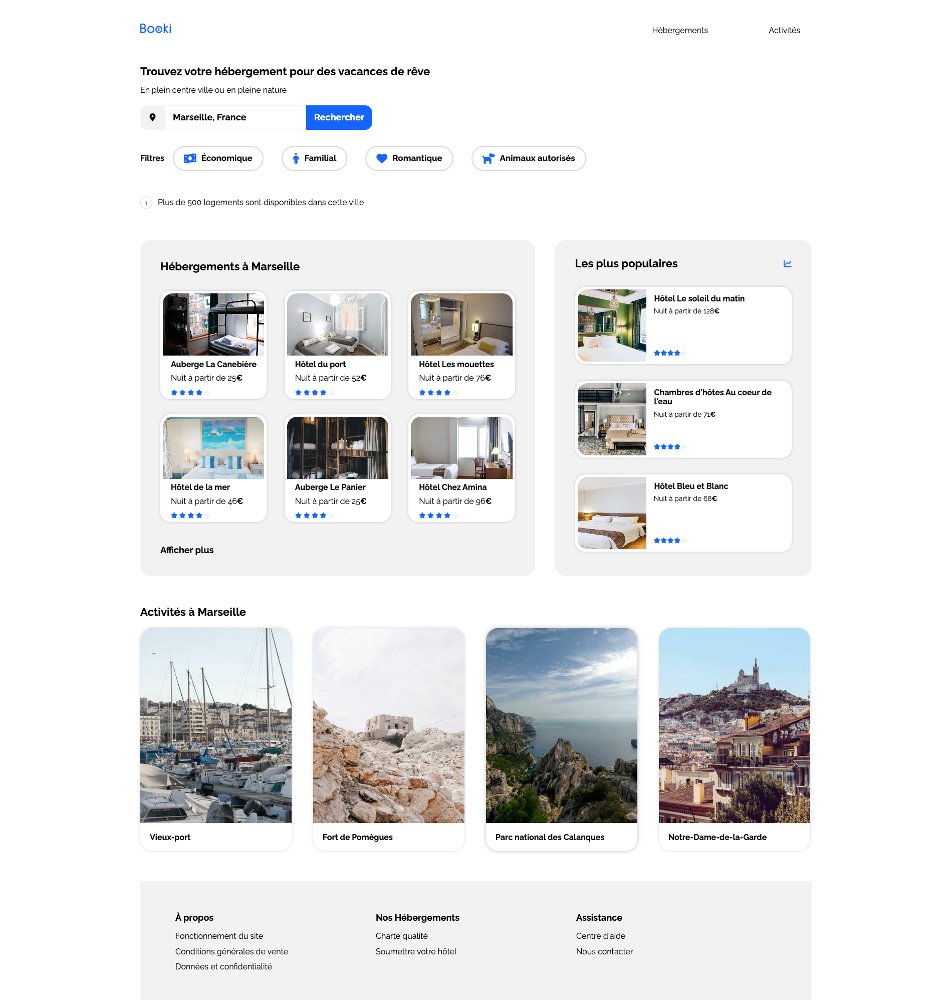
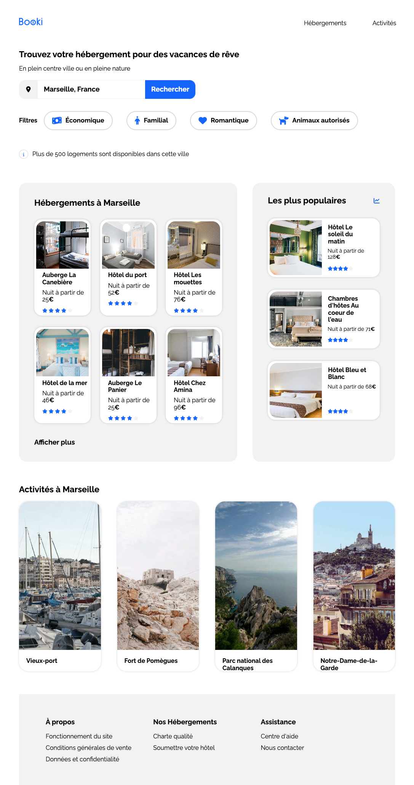

# Projet HTML et CSS avec normalize.css

Ce projet est une démonstration d'un site web simple construit en utilisant HTML et CSS, avec l'inclusion de [normalize.css](https://necolas.github.io/normalize.css/). Le site est conçu pour présenter des hébergements et des activités à Marseille.

## Contenu du Projet

Le projet contient les éléments suivants :

- `index.html` : Le fichier HTML principal qui structure la page web.
- `css/styles.css` : Le fichier CSS qui définit la mise en page et le style du site.
- `css/normalize.css` : Le fichier CSS normalize pour réinitialiser les styles par défaut des navigateurs.
- Le dossier `images` contenant les images utilisées sur le site.

## Comment utiliser

1. Clonez le dépôt en utilisant la commande suivante :
          # Projet HTML et CSS avec normalize.css

Ce projet est une démonstration d'un site web simple construit en utilisant HTML et CSS, avec l'inclusion de [normalize.css](https://necolas.github.io/normalize.css/). Le site est conçu pour présenter des hébergements et des activités à Marseille.

## Contenu du Projet

Le projet contient les éléments suivants :

- `index.html` : Le fichier HTML principal qui structure la page web.
- `css/styles.css` : Le fichier CSS qui définit la mise en page et le style du site.
- `css/normalize.css` : Le fichier CSS normalize pour réinitialiser les styles par défaut des navigateurs.
- Le dossier `images` contenant les images utilisées sur le site.

## Comment utiliser

1. Clonez le dépôt en utilisant la commande suivante :
        git clone <https://github.com/AlanRouille/Projet_2_Booki->

2. Ouvrez le fichier index.html dans votre navigateur pour visualiser le site.

## Aperçu

##

## Technologies Utilisées

- HTML
- CSS
- [normalize.css](https://necolas.github.io/normalize.css/)
- [Font Awesome](https://fontawesome.com/) pour les icônes

## Auteur

Ce projet a été créé par [Openclassrooms](https://openclassrooms.com/fr/).

N'hésitez pas à explorer et à contribuer au projet. Toute contribution est la bienvenue !

J'espère que ce README.md vous aidera à présenter votre projet HTML et CSS sur GitHub. N'oubliez pas de personnaliser les informations telles que votre nom et le lien vers le dépôt.
